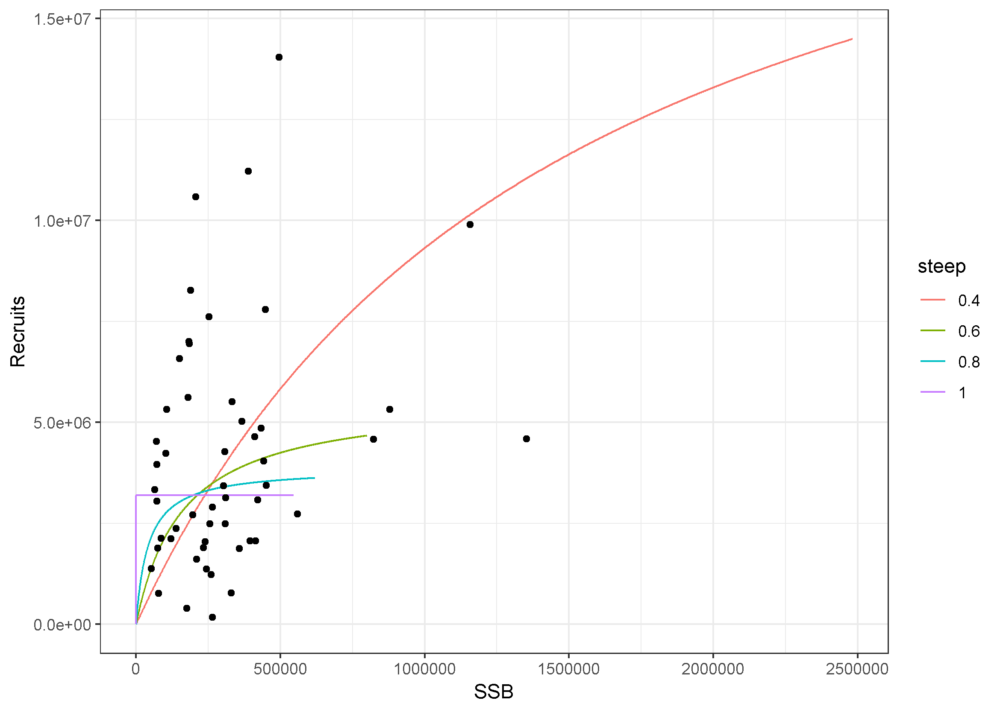
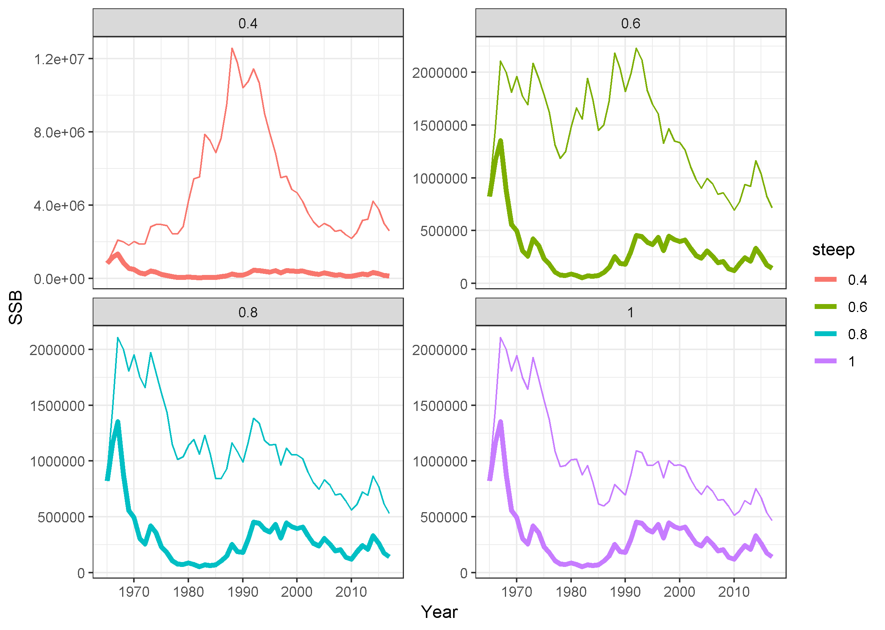
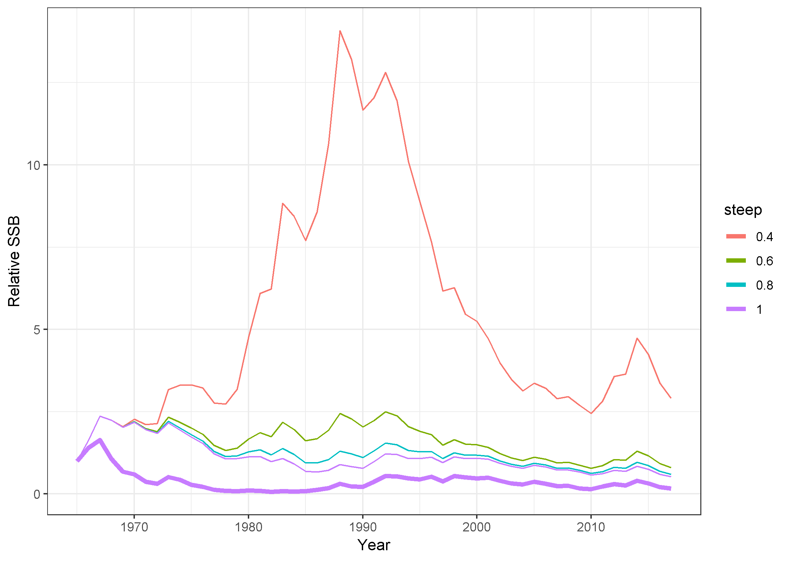

# DynamicB0problem
Demonstrates the problem of dynamic B0 dependency on SR curve .

## What is dynamic B0?
Simply an estimate of what would have happened to a fish population if no fishing had occurred. Computationally, it is found by starting in the first year of the stock assessment with the estimated population and rolling it forward with just natural mortality. The "trick" is that the recruitment is generated based on the stock recruitment curve and the estimated recruitment deviation. This means that whatever caused the recruitment to be above or below the curve would have happened under no fishing independent of the size of the spawning stock biomass. The calculations also assume no changes in the weights at age or maturity at age under no fishing compared to what was observed historically.

The advantage of dynamic B0 is that is allows direct evaluation of the effect of fishing on the population that accounts for the deviations of recruitment from the stock recruitment relationship. This is also its downside though as it depends on a good estimate of the stock recruitment relationship. 

## What was done?
A recent Atlantic herring stock assessment found no ability to estimate a stock recruitment relationship. This assessment was used to demonstrate the dependency of dynamic B0 on the stock recruitment relationship. The stock assessment was run in ASAP with four different fixed values of steepness: 0.4, 0.6, 0.8, and 1.0. The four assessments were nearly identical, but the estimated dynamic B0 and associated depletion (current SSB divided by the current dynamic B0) varied widely, demonstrating the dependence of the approach on the ability to estimate the stock recruitment relationship.

## Into the weeds!

### Dynamic B0 calculation in ASAP
A function was written to use the rdat file output by ASAP to calculate dynamic B0. The function first creates a blank matrix for the population abundance at age and year along with a blank vector for the spawning stock biomass - the dynamic B0 values. The first year in the matrix is filled with the estimated numbers at age from ASAP and the spawning stock biomass (SSB) in the first year computed assuming only natural mortality occurs between the start of the year and the time of spawning. The SSB values use the year-specific weights at age for SSB and maturity at age from the rdat file as well.

The expected recruitment in the following year is calculated from the Beverton and Holt stock recruitment curve estimates of alpha and beta in the rdat file as E(R) = alpha * SSB / (beta + SSB). The recruitment at age 1 in the following year is then created by multiplying the expected recruitment by exponentiating the log-scale recruitment residual: R = E(R) * exp(log_resid) estimated for that year. This means that whatever environmental effects caused recruitment to deviate from the curve would occur again under this no fishing situation. The remainder of the ages in the following year are filled using the exponential decline assocaited with natural moratality: N(y+1,a+1) = N(y,a) * exp(-M(y,a)), with the plus group additionally accounting for the survivors from the previous plus group. The SSB is calculated for this year and used to estimate recruitemnt in the following year. This process continues through all the years estimated in the rdat file. The function then returns the time series of spawning stock biomass under the assumption of no fishing (dynamic B0).

### What happened?
As mentioned above, the four stock assessments were nearly identical. They all had the same objective function value (3773.103), the SSB varied by a maximum of 0.1 metric tons (mean SSB 310,000 metric tons), and the age-1 recruitment estimates varied by a maximum of 1,000 fish (mean recruitment 4.1 billion fish). However, due to fixing the steepness at different values, the estimated R0 varied widely:
| Steepness | R0 (thousands) |
| --------- | -------------- |
| 0.4       | 14,493,710     |
| 0.6       |  4,669,791     |
| 0.8       |  3,621,096     |
| 1.0       |  3,193,192     |

The stock recruitment curves all pass through the data reasonably well.

Computing the dynamic B0 resulted in large differences among the four steepness values both in absolute and relative scales.

The current depeletion was estimated as the SSB in the final year from the original assessment divided by the dynamic B0 value in the final year, and varied widely:
| Steepness | Current Depletion |
| --------- | ----------------- |
| 0.4       |   0.055   |
| 0.6       |   0.198   |
| 0.8       |   0.266   |
| 1.0       |   0.303   |

## Conclusion
The dynamic B0 approach depends on the ability to estimate the stock recruitment relationship correctly. In situations where this is not possible, such as the Atlantic herring stock assessment, the approach should not be used.
